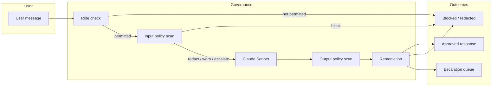

# AI Governance Platform

A governed AI assistant for financial services teams. Every user message and model response is checked against organizational policies before and after the model answers — with clear outcomes for compliance, security, and audit.

---

## Part 1 — Overview (for business & compliance stakeholders)

### What is this?

The AI Governance Platform wraps a large language model (Claude) in a **policy enforcement layer** designed for regulated environments. Users interact through a familiar chat interface, but the system:

- Verifies **who** is asking (role-based access)
- Scans **what** they send and **what** the model returns
- Takes **automatic action** when policies are violated (block, redact, warn, or escalate)
- Leaves an **audit trail** for reviewers

Think of it as guardrails plus a paper trail — not just a chatbot.

### Who is it for?

| Role | Typical use |
|------|-------------|
| **Admin** | Full access, policy and user management |
| **Compliance Officer** | Audits, regulatory exports, PII-related lookups |
| **Analyst** | Analytics and dashboards (no direct PII access) |
| **Customer Service** | General support and knowledge base (restricted sensitive queries) |

Roles are enforced before the model is called, so unauthorized query types are stopped early with a plain-language explanation.

### Key features

**Governed chat**

- Role selector drives what each user is allowed to ask
- Responses include a collapsible **Governance Details** panel (query type, authorization, policies scanned, violations, remediation)
- Violations are color-coded by severity (critical → low)

**Policy engine**

Six built-in policies (configurable via `config/policies.json`):

| Policy | What it catches | Typical action |
|--------|-----------------|----------------|
| PII detection | Emails, phones, SSNs, card numbers | Redact |
| Prompt injection | Jailbreaks, instruction overrides | Block |
| Confidential data | Internal / unreleased business information | Escalate |
| Harmful content | Violence, self-harm, illegal instructions | Block |
| Toxicity | Harassment, hate speech | Warn |
| Named entity PII | Person / org / location identifiers | Redact |

Detection combines **rules (regex)** and **AI scoring (Claude Haiku)** where configured.

**Near-miss flagging**

When content scores close to a policy threshold but does not quite trigger a violation, the system records a **near miss** — useful for tuning policies before real incidents occur.

**Escalation queue**

Compliance reviewers see session items that need attention:

- Escalations (e.g. confidential-data policy)
- Near misses (threshold tuning candidates)

Reviewers can mark items True Positive / False Positive / Near Miss, add notes, and **adjust thresholds** for near-miss policies.

**Audit trail**

Every interaction in a session is logged with timestamp, role, violations, blocks, and escalations. Sensitive fields are **redacted** in the UI and CSV export for demo safety. Export to CSV for offline review.

**Policy versioning**

Policy changes (manual save or file upload) are snapshotted in the UI. Previous versions can be **restored** with a full history of what changed and when.

### How it works (high level)



1. **Classify** the query type and check it against the user’s role.  
2. **Scan input** against all enabled input policies.  
3. If allowed, **generate** an answer with Claude Sonnet (using governed system instructions).  
4. **Scan output** and apply the same remediation rules.  
5. **Record** the result for audit and escalation review.

---

## Part 2 — Technical documentation

### Architecture

| Component | File | Role |
|-----------|------|------|
| Policy engine (MCP) | `server.py` | Loads policies/roles; exposes scan and classify tools over stdio |
| Remediation agent | `agent.py` | Orchestrates MCP + Sonnet; applies block/redact/warn/escalate |
| Web UI | `app.py` | Streamlit: chat, policy dashboard, audit trail, escalation queue |
| Policy upload validation | `policy_validation.py` | JSON schema, ReDoS-safe regex checks, 1 MB upload cap |
| Audit redaction | `redaction.py` | Redacts PII-like patterns in audit trail entries and exports |
| Policies | `config/policies.json` | Detection rules, thresholds, actions |
| Roles | `config/roles.json` | Permitted / restricted query types per role |

**MCP connection model**

| Context | Behavior |
|---------|----------|
| **Streamlit app** | One long-lived `server.py` subprocess per browser session (`PolicyEngineMcp` in `agent.py`). Later chat messages reuse the same process for lower latency. |
| **Tests / CLI** | `process_interaction()` still spawns a one-shot MCP subprocess per call. |
| **Cursor / MCP clients** | Connect directly to `server.py` over stdio (see below). |

**Config reload:** On every MCP tool call, the policy engine reloads all files from `config/` (policies, roles, and any future config added to `_reload_config()`). Dashboard saves and uploads apply to the **next** scan without restarting the server. The `reload_config` tool forces a reload explicitly.

### Scan performance

The policy engine optimizes latency and API usage on each scan:

- **Block policies first**, evaluated in parallel (up to 4 concurrent Haiku calls).
- **Short-circuit:** If any block policy fires on input, non-block policies are skipped for that scan.
- **Regex short-circuit:** For block policies, a regex match skips the Haiku call for that policy.

These changes reduce Anthropic usage on blocked input; parallel scans mainly improve response time when many policies still run.

### Security (demo scope)

| Control | Implementation |
|---------|----------------|
| Policy upload validation | `policy_validation.py` — schema, pattern safety, size limit (aligned with `.streamlit/config.toml` `maxUploadSize = 1`) |
| Audit redaction | `redaction.py` — masks emails, phones, SSNs, cards in stored/exported audit rows |
| No production auth | Role selector is UI-only; not suitable for multi-tenant production without real identity |

### Requirements

- Python 3.11+ (3.14 tested locally)
- [Anthropic API key](https://console.anthropic.com/) (`ANTHROPIC_API_KEY`)
- See `requirements.txt` (runtime) and `requirements-dev.txt` (+ pytest)

**Note on `pywin32`:** It is **not** pinned in `requirements.txt`. The `mcp` package installs it only on Windows (`sys_platform == "win32"`). **Streamlit Cloud (Linux) does not install pywin32.**

### Setup

```bash
git clone https://github.com/nakulshukla21-dev/ai-governance-platform.git
cd ai-governance-platform

python -m venv .venv
# Windows
.venv\Scripts\activate
# macOS / Linux
source .venv/bin/activate

pip install -r requirements-dev.txt
cp .env.example .env
# Edit .env and set ANTHROPIC_API_KEY=sk-ant-...
```

### Run the Streamlit app (local)

Default local port is **8503** (see `.streamlit/config.toml`) to avoid clashing with other apps on 8501/8502.

```bash
streamlit run app.py
# or
.\run_app.ps1
```

Override port:

```bash
streamlit run app.py --server.port 8504
```

**Streamlit Community Cloud** ignores `server.port` in config and serves on **8501**. Set `ANTHROPIC_API_KEY` in app secrets. Use `requirements.txt` as the packages file.

### Run the MCP server standalone (optional)

Used by Cursor / Claude Desktop or for debugging — not for end users:

```bash
python server.py
```

The process waits on stdio; Ctrl+C exits with a normal `KeyboardInterrupt` traceback.

### MCP client configuration (Cursor)

```json
{
  "mcpServers": {
    "ai-governance": {
      "command": "python",
      "args": ["C:/path/to/ai-governance-platform/server.py"],
      "env": {
        "ANTHROPIC_API_KEY": "your-key"
      }
    }
  }
}
```

### Tests

```bash
# Unit tests only (no API key)
pytest test_agent.py test_server_scan.py test_server_reload.py test_policy_validation.py test_redaction.py -m "not integration" -v

# Full suite including live API + MCP
pytest -v

# Smoke test: persistent MCP + config reload (requires API key)
python scripts/test_persistent_mcp.py
```

Integration tests are skipped automatically when `ANTHROPIC_API_KEY` is unset (`conftest.py`).

### Policy configuration

- **Per-scope thresholds** in `thresholds.input` / `thresholds.output`
- **LLM policies** return `violation_confidence` (0.0–1.0); detection requires `detected` and confidence ≥ threshold (ensemble also allows regex hits)
- **Near miss:** non-detected scan with confidence in `[threshold × 0.9, threshold)`

### Limitations

| Area | Limitation |
|------|------------|
| **Hosting** | Streamlit Cloud must spawn `server.py` subprocess with network access for Anthropic; cold starts and timeouts may apply |
| **Session scope** | Audit trail and escalation queue are **per browser session** only — not persisted to a database |
| **LLM variability** | Query classification and policy scoring use Haiku/Sonnet; results can vary slightly between runs |
| **Near misses** | Require LLM scan confidence in the near-miss band; regex-only near misses are uncommon |
| **Role enforcement** | Based on predicted query type, not manual user attestation |
| **Policy updates** | Reloaded from disk on each MCP tool call; very large policy sets may add small per-scan I/O cost |
| **Output blocking** | A blocked output replaces the model answer with an explanation — no partial response |
| **Scale** | Designed for demonstration and team pilots, not high-volume production without adding persistence, auth, and async job queues |
| **First message latency** | First chat in a session pays MCP subprocess startup (~1–2s locally); later messages reuse the session engine |
| **Streamlit reruns** | First submit may trigger two Streamlit reruns; rare duplicate MCP startup on the first message only |

### Repository structure

```
ai-governance-platform/
├── app.py                      # Streamlit UI
├── agent.py                    # Remediation agent + PolicyEngineMcp
├── server.py                   # MCP policy engine
├── policy_validation.py        # Upload / save validation
├── redaction.py                # Audit trail redaction
├── config/
│   ├── policies.json
│   └── roles.json
├── scripts/
│   └── test_persistent_mcp.py  # MCP session + reload smoke test
├── test_fixtures/              # Invalid policy uploads for tests
├── test_agent.py
├── test_server_scan.py
├── test_server_reload.py
├── test_policy_validation.py
├── test_redaction.py
├── conftest.py
├── pytest.ini
├── requirements.txt
├── requirements-dev.txt
├── run_app.ps1
└── .streamlit/config.toml
```

## Author

**Nakul Shukla** — SVP Product Manager, AI/ML & RegTech | [LinkedIn](https://www.linkedin.com/in/nakul-shukla-62961853/)
